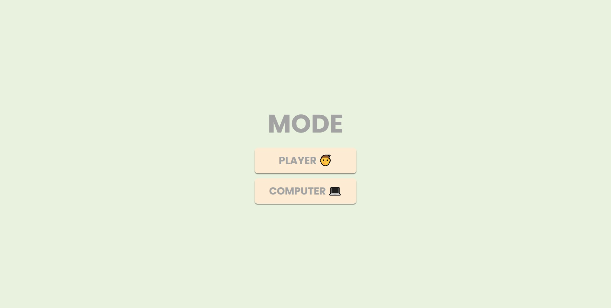
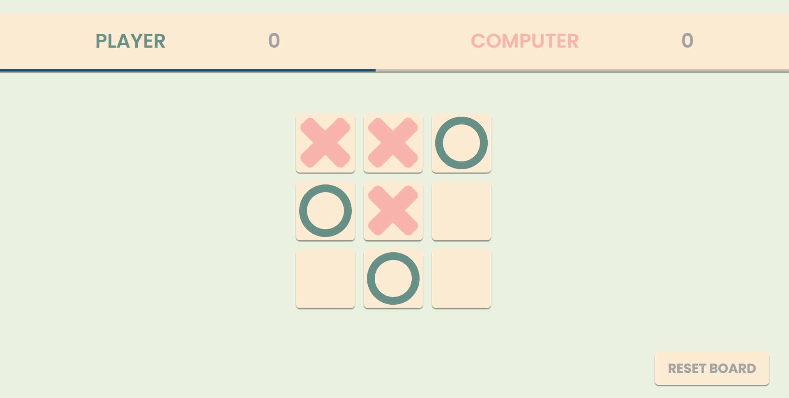

# TicTacToe

https://radman17.github.io/TicTacToe/

TicTacToe (web version) made using using HTML , CSS and JS.

## Table of contents

* [About The Project](#about-the-project)

* [Tech Stack](#tech-stack) 

* [Getting Started](#getting-started)

## About The Project

This is a very simple TicTacToe web game .

### How to play 

- You can play the game in two modes (player & computer)

- You can mark each cell by clicking on it, afterward its the next player turn.

- The objective is to mark three cells in a row (horizontally , vertically , diagonally) before your opponent.

- After each round you can reset the board by clicking RESET BOARD button.

### How the game looks

 Mode page :



 Game page :



## Tech Stack

* HTML
* CSS
* JavaScript

## Getting Started

1. Clone the repo
```sh
git clone https://github.com/radman17/TicTacToe.git
```
2. Change the directory
```sh
cd TicTacToe
```
3. Open the index.html file .
